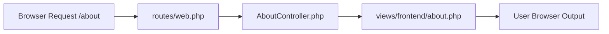
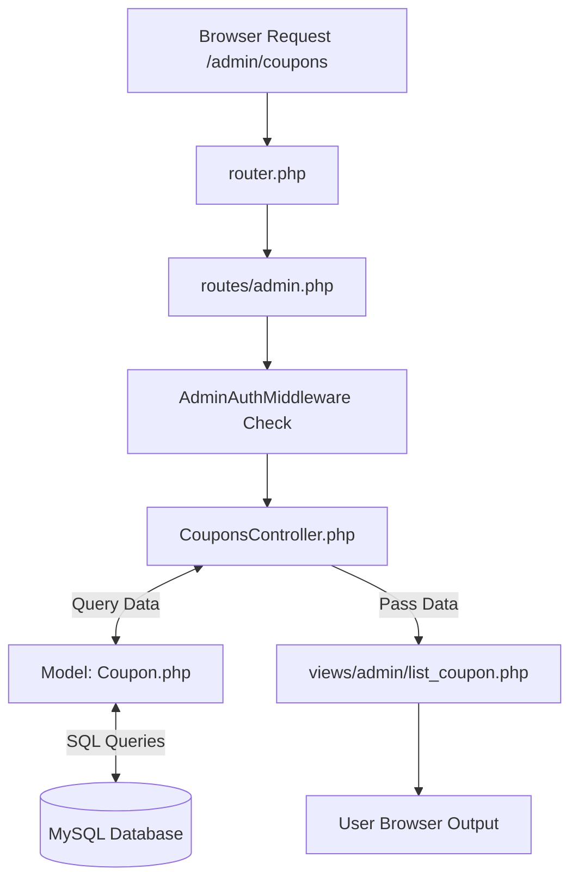

# Laguna MVC Framework — Quick & Simple Developer Guide

Is guide mein hum seekhenge ke **Laguna Framework** mein 2 tareeqon se pages/modules kaise add kiye jaate hain:
1. **Normal / Static Page** (Bina Database ke — e.g., About Us, Privacy Policy)
2. **Dynamic Module** (Database, Model, Controller & View ke sath — e.g., Products, Coupons, Users)

---

## 📌 Architecture Overview

Laguna custom **MVC (Model-View-Controller)** structure par chalta hai:

- **Routing (`routes/`)**: Request URL ko Controller se connect karta hai.
- **Controller (`app/Controllers/`)**: Page render karta hai aur business logic handle karta hai.
- **Model (`app/Models/`)**: Database (MySQL) se data fetch/save karta hai.
- **View (`views/`)**: HTML/CSS frontend aur admin templates display karta hai.

---

# 🔹 1. Normal / Static Page (Bina Database Ke)

Agar aapko koi simple page banana hai jisme Database ki zaroorat nahi hai (jaise **Privacy Policy**, **About Us**, ya **Contact Us** page):

### 📊 Static Page Flow Graph


---

### Step-by-Step Implementation:

#### Step 1: View File Banayein
Subse pehle HTML content ke liye file banayein `views/frontend/privacy.php`:

```php
<!-- views/frontend/privacy.php -->
<?php view('frontend/layouts/header'); ?>

<main class="container">
    <h1>Privacy Policy</h1>
    <p>Welcome to our privacy policy page...</p>
</main>

<?php view('frontend/layouts/footer'); ?>
```

#### Step 2: Controller Banayein
File banayein `app/Controllers/Frontend/PrivacyController.php`:

```php
<?php
namespace App\Controllers\Frontend;

class PrivacyController {
    public static function index() {
        view('frontend/privacy');
    }
}
?>
```

#### Step 3: Route Register Karein
Open karein `routes/web.php` aur URL link add karein:

```php
return [
    '/'         => 'Frontend\HomeController@index',
    '/privacy'  => 'Frontend\PrivacyController@index', // <-- Naya Route
];
```

✅ **Ho Gaya!** Ab browser mein `http://localhost/laguna/privacy` kholne par aapka static page dikhega.

---

# 🔸 2. Dynamic Module (Database Ke Sath)

Agar aapko aisa module banana hai jo Database (MySQL) se data fetch kare (jaise **Products**, **Coupons**, ya **Categories**):

### 📊 Dynamic Module Flow Graph


---

### Step-by-Step Implementation:

#### Step 1: MySQL Database Table Banayein
MySQL (phpMyAdmin) mein naya table banayein:

```sql
CREATE TABLE `coupons` (
  `id` INT AUTO_INCREMENT PRIMARY KEY,
  `code` VARCHAR(50) NOT NULL,
  `discount_percent` INT NOT NULL
);
```

#### Step 2: Model Class Banayein
Database queries ke liye file banayein `app/Models/Coupon.php`:

```php
<?php
namespace App\Models;

class Coupon {
    // Database se tamaam records fetch karne ke liye
    public static function all() {
        $conn = \get_db_connection();
        return $conn->query("SELECT * FROM coupons ORDER BY id DESC");
    }

    // Delete karne ke liye
    public static function delete($id) {
        $conn = \get_db_connection();
        $stmt = $conn->prepare("DELETE FROM coupons WHERE id = ?");
        $stmt->bind_param("i", $id);
        return $stmt->execute();
    }
}
?>
```

#### Step 3: Controller Banayein
Logic aur data handle karne ke liye file banayein `app/Controllers/Admin/CouponsController.php`:

```php
<?php
namespace App\Controllers\Admin;

use App\Middleware\AdminAuthMiddleware;
use App\Models\Coupon;

class CouponsController {
    public static function list() {
        // 1. Admin login check
        AdminAuthMiddleware::handle();

        // 2. Database se data lana
        $coupons = Coupon::all();

        // 3. View ko render karna aur data bhejna
        view('admin/sidebar');
        view('admin/list_coupon', ['coupons' => $coupons]);
    }
}
?>
```

#### Step 4: Route Register Karein
Open karein `routes/admin.php` aur route add karein:

```php
return [
    'routes' => [
        '/admin/dashboard' => 'Admin\DashboardController@index',
        '/admin/coupons'   => 'Admin\CouponsController@list', // <-- Naya Route
    ]
];
```

#### Step 5: Dynamic View File Banayein
View file banayein `views/admin/list_coupon.php` jahan data display hoga:

```php
<!-- views/admin/list_coupon.php -->
<div class="main-content">
    <h2>All Coupons</h2>
    <table>
        <thead>
            <tr>
                <th>ID</th>
                <th>Coupon Code</th>
                <th>Discount</th>
            </tr>
        </thead>
        <tbody>
            <?php if (!empty($coupons)): ?>
                <?php while ($row = $coupons->fetch_assoc()): ?>
                    <tr>
                        <td><?php echo $row['id']; ?></td>
                        <td><?php echo htmlspecialchars($row['code']); ?></td>
                        <td><?php echo $row['discount_percent']; ?>%</td>
                    </tr>
                <?php endwhile; ?>
            <?php else: ?>
                <tr><td colspan="3">No coupons found.</td></tr>
            <?php endif; ?>
        </tbody>
    </table>
</div>
```

#### Step 6: Sidebar Mein Link Add Karein
`views/admin/sidebar.php` mein naya menu option add karein:

```php
<a href="<?php echo base_url('/admin/coupons'); ?>">Coupons</a>
```

---

## ⚡ Summary Comparison Table

| Feature | 🔹 Normal / Static Page | 🔸 Dynamic Module |
| :--- | :--- | :--- |
| **Database Table Needed?** | ❌ Nahi | ✅ Haan (MySQL) |
| **Model File Needed?** | ❌ Nahi | ✅ Haan (`app/Models/`) |
| **Controller Needed?** | ✅ Haan (`app/Controllers/`) | ✅ Haan (`app/Controllers/`) |
| **Route Needed?** | ✅ Haan (`routes/web.php`) | ✅ Haan (`routes/admin.php` / `routes/web.php`) |
| **View Needed?** | ✅ Haan (`views/frontend/`) | ✅ Haan (`views/admin/` ya `views/frontend/`) |

---

## 💡 Important Helper Functions

- `view('folder/filename', $data)`: View file load karta hai aur variables pass karta hai.
- `base_url('/path')`: Clean aur dynamic URL generate karta hai.
- `get_db_connection()`: MySQL connection return karta hai.
